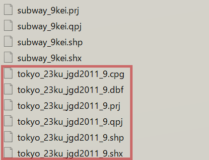

```{r, message=FALSE, echo=FALSE}
library(tmap)
library(mapview)
library(sf)
library(stars)
library(htmlwidgets)
library(htmltools)
```

# sfとベクターデータ
ここからsfというパッケージを使ってをベクターデータを実際に扱っていきます。

<br />

**sfパッケージについて**  
sfパッケージとは前のchapterで紹介したベクターデータ(Simple Features)を扱うためのパッケージです。これが開発される以前はspパッケージが主流でしたが、近年の環境に合わせるとsfの方が適していると思われます。  
chapter7で紹介するstarsパッケージと開発者が同じであり、dplyrなどの有名なパッケージとの互換性も高いため、扱いやすいパッケージです。

<br />

**シェープファイルの構造**  
ベクターデータの代表的な拡張子は.shp(シェープファイル)です。シェープファイルは以下のようにファイル群で構成されています。読み込みなどでは.shpのみを使用しますが、.pcgから.shxがなければ機能しなくなります。ファイルを移動する際には、これらのファイルを全て移動させるように気を付けてください。  

<br />



## シェープファイルの読み込み
まず、使用するデータをダウンロードします。  
[「GIS実習オープン教材」](https://gis-oer.github.io/gitbook/book/)の[データの読み込み](https://gis-oer.github.io/gitbook/book/materials/QGIS/QGIS.html#%E3%83%87%E3%83%BC%E3%82%BF%E3%81%AE%E8%AA%AD%E3%81%BF%E8%BE%BC%E3%81%BF)から**tokyo.zip**ファイルダウンロード、解凍してください。  
その中身のtokyoフォルダをwork directoryに置いてください。

<br />
では、tokyo23区の行政区データを読み込んでみましょう。関数はsfパッケージの`st_read`を使います。(ちなみにstはSpatial Temporal：時空間の～、を意味しています。)  
<br />
`st_read`の使い方
```
st_read("読み込みたいデータのパス")
```


```{r message=FALSE, results='hide'}
library(sf)
tokyo23 <- st_read("tokyo/tokyo_23ku_jgd2011_9.shp")
```
これで、tokyo_23ku_jgd2011_9という23行政区のシェープファイルを、tokyo23と名付けてRstudioで開くことが出来ました。

<br />
次に読み込んだtokyo23の中身を見てみましょう。
```{r}
tokyo23
```
sfで読み込んだデータとはいえ、通常のデータと変わりはほとんどありません。ただ通常のデータと違う点はgeometryという変数が付いていることです。  
念のため上から順に見ていきます。  

<br />

+ 23個のfeatureに対して7つのfields（7変数：name ~ density）があります。  
+ geometry type：ベクターデータの種類を示しています。今回は行政区データなのでポリゴン(MULTIPOLYGON)です。  
+ dimension：xy平面、つまり2次元ということです。  
+ bbox：位置情報の最大値と最小値です。あまり気にしなくて構いません。
+ projected CRS：どの座標系(CRS)で投影しているかを示しています。今回はJGD2011_Japan_Plane_Rectangular_CS_IXというCRSを使っています。後でEPSG:32654に変換させます。

<br />
sfデータは要するに、通常のデータに位置情報（geometry）が付与されているだけです。一度データを表示してみましょう。tmapというパッケージを使います。このパッケージを使えば静止画ではなくインタラクティブな描写が可能です。行政区をクリックすれば、データに位置情報が付与されているのが分かるでしょう。  
`tmap`の使い方は後で紹介します。
```{r message=FALSE}
library(tmap)
tmap_mode("view")
tm_shape(tokyo23) +
  tm_polygons()
```


<br />
ちなみにclassはsfとなっています。
```{r}
class(tokyo23)
```


## CRSの変更

では次にCRSの変更をします。読み込んだデータのCRSの確認は`st_crs`を使います。
```{r}
st_crs(tokyo23)
```
今User InputがJGD2011_Japan_Plane_Rectangular_CS_IXとなっています。これが、このデータのデフォルトのCRSです。これをEPSG:32654に変換させます。`st_transform`で変更可能です。  
　
<br />
`st_transform`の使い方
```
st_transform(変換したいデータ, 変更先のCRSコード)
```

```{r}
#CRSを変更したtokyo_UTMを作成
tokyo23_UTM <-　st_transform(tokyo23, 32654)　

#CRSの確認
st_crs(tokyo23_UTM)
```
User inputがEPSG:32654に変更されました。これで通常の平面のように、メートルなどの単位を使えるCRSに変更されました。

<br />
パイプ演算子(%>%)を使えばtokyo23_UTMのようなデータを増やすことなく、楽に変換ができます。  
パイプ演算子については**[こちら](https://shohei-doi.github.io/quant_polisci/pipe.html)**をご覧ください
```{r message=FALSE}
#パイプ演算子を含むパッケージを読み込む
library(dplyr)

#変換
tokyo23 <- tokyo23 %>% st_transform(32654)

#CRSの確認
st_crs(tokyo23)
```

どちらの方法でも、User inputがEPSG:32654に変更されました。

## sfデータの描写
sfデータを表示方法を、ここでは3種類紹介します。(ggplot2はここでは紹介しません。)  
まずは**plot**です。plotはRにもともと入っている関数です。libraryで何かを読み込む必要はありません。
```{r}
plot(tokyo23)
```

通常のplotでは変数全てに対応して色分けされるので、表示される画像が多くなります。  
そんな時は、変数を指定して色分け表示することも可能です。
```{r}
tokyo23[,"population"] %>%
  plot()
```
　
　
別の方法として`st_geometry`があります。st_geometryはsfデータの中からをgeometryだけを抜き出します。これを間に挟んでplotしてみます。  
<br />
`st_geometry`の使い方
```
st_geometry(geometryを抜き出したいデータ)
```

```{r}
st_geometry(tokyo23)
```
抜き出されたgeometryの内、先頭5つが表示されました。

このst_geometryを間に挟めば、geometryだけを抜き出して以下のように表示することができます。
```{r}
tokyo23 %>% 
  st_geometry() %>% 
  plot()
```


<br />
2つ目はtmapです。tmapはインタラクティブな表示をすることができます。　　
tmapの使い方は**[こちら](https://qiita.com/ocean_f/items/700aff67f3e35266b0fe)**から確認してください。
```{r message=FALSE}
library(tmap)
#インタラクティブな表示をするモードに切り替えます。
tmap_mode("view")


tm_shape(tokyo23) +
  tm_polygons()
```

<br />
3つ目はmapViewです。tmapと同じようにインタラクティブな表示ができます。mapviewはtmapと違って簡便にインタラクティブな表示をすることが可能です。  
（これを実行すると何故かweb上で表示できないため実行していません。手元の作業環境でもknit → previewを行えば問題なく実行されると思います。）
```{r}
#インタラクティブな表示のためにはviewモードを設定しますが、設定済みなので省略します。
#tmap_mode("view")

#mapview(tokyo23), ←実行していません
```

